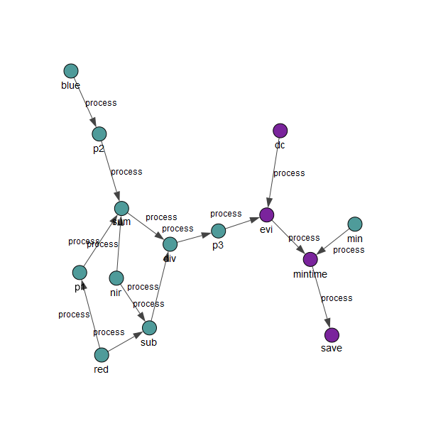

# openeo-pg-parser-python

This package allows to parse an *openEO* process graph (JSON) and convert it to a traversable Python object (`graph`).
The resulting directed `graph` object consists of nodes and edges and can help for instance to identify node relationships 
or to sort a graph by a specific attribute. The nodes are instances of `OpenEONode`, which can be used to extract information from itself, e.g., if it is a reducer and if so what dimension is used for reduction, or the direct neighbours, i.e., parent and child processes.
The nodes are connected via directed edges which represent the data flow (input and output) and can have two values: "data" or "process". "data" specifies that the output of one node is the input for the second node.
"process" is a connection between two processes, whereas the parent process is the one which needs to be completed first, before its data can be used by the child process or passed on to subsequent nodes. 

Moreover, one can display a parsed process graph `process graph` in two ways. Once via `print(process graph)` to print the string representation of all the nodes in the graph and once via `process_graph.plot()`.
The latter option uses the Python package *igraph* to plot the graph on a map.


## Installation


1.  At the moment, this package is only installable from source.
    So start with cloning the repository:

        git clone https://github.com/Open-EO/openeo-pg-parser-python.git
        cd openeo-pg-parser-python

2.  It is recommended to install this package in a virtual environment,
    e.g. by using [`venv` (from the Python standard library)](https://docs.python.org/3/library/venv.html),
    `virtualenv`, a conda environment, ... For example, to create a new virtual
    environment using `venv` (in a folder called `.venv`) and to activate it:

        python3 -m venv .venv
        source .venv/bin/activate

    (You might want to use a different bootstrap python executable
    instead of `python3` in this example.)

3. Install the package in the virtual environment using one of the following ways, as you prefer:

    - traditional way: `python setup.py install`
    - with pip: `pip install .`
    - if you plan to do development on the `openeo-pg-parser-python` package itself,
        install it in "development" mode with `python setup.py develop` or `pip install -e .`

    (Note that in this step we are using `python` and `pip` from the virtual environment.)


## Example

As a short example, we can translate the following process graph, which loads S-2 data and computes the minimum EVI value over a specific time span.
```json
{"process_graph":
  {
      "dc": {
        "process_id": "load_collection",
        "description": "Loading the data; The order of the specified bands is important for the following reduce operation.",
        "arguments": {
          "id": "S2MSI2A",
          "spatial_extent": {
            "west": 11.279182434082033,
            "east": 11.406898498535158,
            "north": 46.522729291844286,
            "south": 46.464349400461145
          },
          "temporal_extent": ["2018-06-04", "2018-06-23"],
          "bands": ["B4", "B8"]
        }
      },
      "evi": {
        "process_id": "reduce_dimension",
        "description": "Compute the EVI. Formula: 2.5 * (NIR - RED) / (1 + NIR + 6*RED + -7.5*BLUE)",
        "arguments": {
          "data": {"from_node": "dc"},
          "dimension": "spectral",
          "reducer": {
            "process_graph": {
              "nir": {
                "process_id": "array_element",
                "arguments": {
                  "data": {"from_parameter": "data"},
                  "index": 0
                }
              },
              "red": {
                "process_id": "array_element",
                "arguments": {
                  "data": {"from_parameter": "data"},
                  "index": 1
                }
              },
              "blue": {
                "process_id": "array_element",
                "arguments": {
                  "data": {"from_parameter": "data"},
                  "index": 2
                }
              },
              "sub": {
                "process_id": "subtract",
                "arguments": {
                  "data": [{"from_node": "nir"}, {"from_node": "red"}]
                }
              },
              "p1": {
                "process_id": "product",
                "arguments": {
                  "data": [6, {"from_node": "red"}]
                }
              },
              "p2": {
                "process_id": "product",
                "arguments": {
                  "data": [-7.5, {"from_node": "blue"}]
                }
              },
              "sum": {
                "process_id": "sum",
                "arguments": {
                  "data": [10000, {"from_node": "nir"}, {"from_node": "p1"}, {"from_node": "p2"}]
                }
              },
              "div": {
                "process_id": "divide",
                "arguments": {
                  "data": [{"from_node": "sub"}, {"from_node": "sum"}]
                }
              },
              "p3": {
                "process_id": "product",
                "arguments": {
                  "data": [2.5, {"from_node": "div"}]
                },
                "result": true
              }
            }
          }
        }
      },
      "mintime": {
        "process_id": "reduce_dimension",
        "description": "Compute a minimum time composite by reducing the temporal dimension",
        "arguments": {
          "data": {"from_node": "evi"},
          "dimension": "temporal",
          "reducer": {
            "process_graph": {
              "min": {
                "process_id": "min",
                "arguments": {
                  "data": {"from_parameter": "data"}
                },
                "result": true
              }
            }
          }
        }
      },
      "save": {
        "process_id": "save_result",
        "arguments": {
          "data": {"from_node": "mintime"},
          "format": "Gtiff"
        },
        "result": true
      }
  }
}
```
After parsing this process graph we get the following graph structure (only showing "process" edges):



Please have a look at the Jupyter Notebooks under "examples" for further details.

## Contribution

If you want to contribute to this project in terms of new functionality, bug fixes or openEO API alignments, please follow the instructions below:
* Fork this repo 
* Add your feature or bug fix
* Add a test or extend a test 
* Create a PR to the master branch
* One of the responsible persons for this project will check the PR and complete it if everything is fine

## Note

This project has been set up using PyScaffold 3.1. For details and usage
information on PyScaffold see https://pyscaffold.org/.
